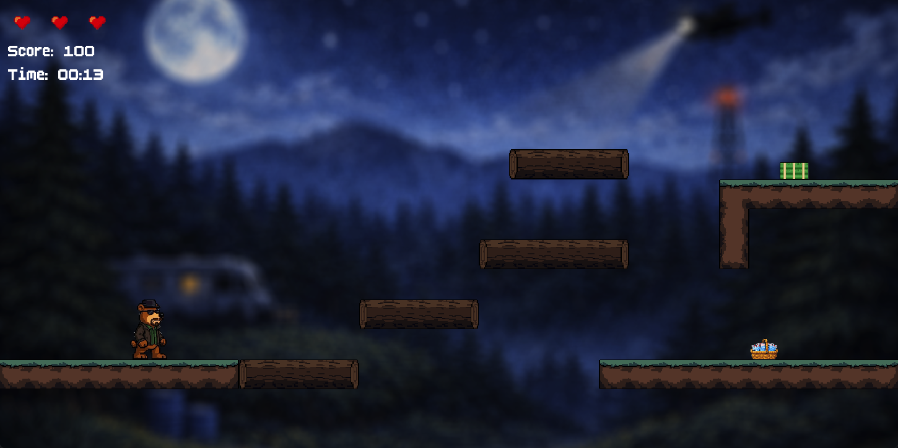
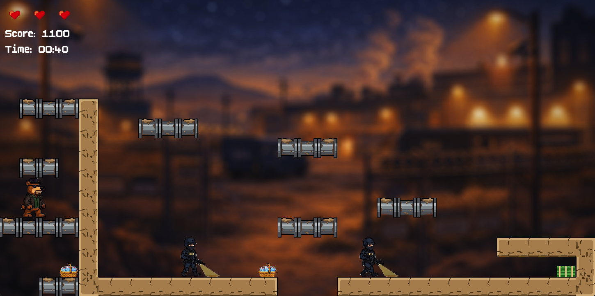
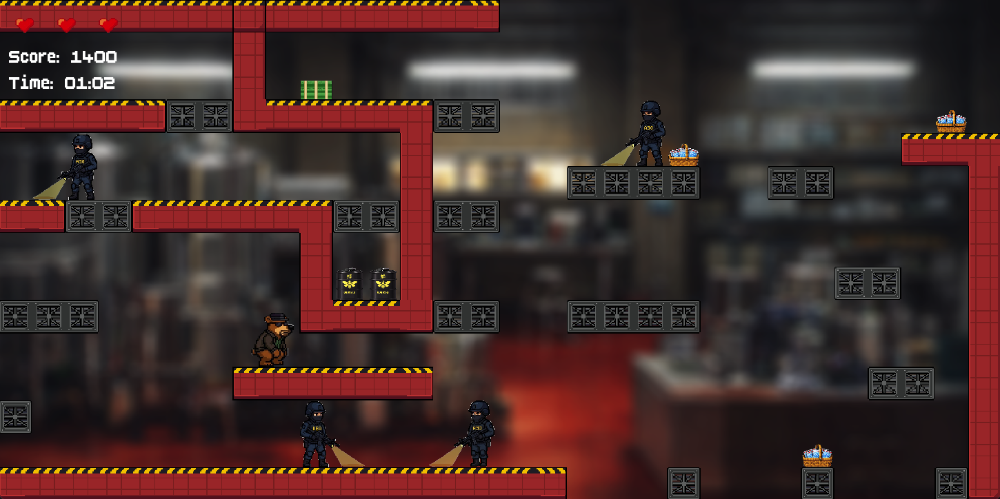

# 🐻 Yogi Heisenbear

Yogi Heisenbear is an action-packed platformer game where you guide Heisenbear through dangerous territories. Collect meth baskets, guns and money, dodge the relentless agents, and navigate treacherous terrain across multiple difficulty levels. With dynamic music and challenging gameplay, can you complete the levels and top the leaderboard?

## Screenshots

| Main Menu | Easy Level |
|:---:|:---:|
|  |  |

| Medium Level | Hard Level |
|:---:|:---:|
|  |  |


## For Players: How to Run the Game

### Quick Start (Any Platform)
1. Make sure you have Java installed (Java 8 or higher)
   - Check with: `java -version`

2. Run the game:
   ```bash
   java -jar YogiHeisenbear.jar
   ```

### Easy Launch Scripts

**macOS/Linux:**
```bash
./run.sh
```

**Windows:**
Double-click `RUN.bat`

---

## For Developers: Building the Game

### Build the executable JAR:

**macOS/Linux:**
```bash
chmod +x build-jar.sh
./build-jar.sh
```

**Windows:**
```cmd
build-jar.bat
```

This creates `YogiHeisenbear.jar` which can be distributed and run on any platform with Java.

---

## Distribution

To distribute your game:
1. Build the JAR using the build script above
2. Give users:
   - `YogiHeisenbear.jar`
   - `RUN.bat` (for Windows) or `run.sh` (for Mac/Linux)
   - Instructions to install Java if they don't have it

See `HOW_TO_BUILD.md` for advanced packaging options (creating macOS .app bundles, Windows .exe files, etc.)

---

## Controls
- A & D: Move
- W: Jump
- S: Crouch

Enjoy the game! 🎮
